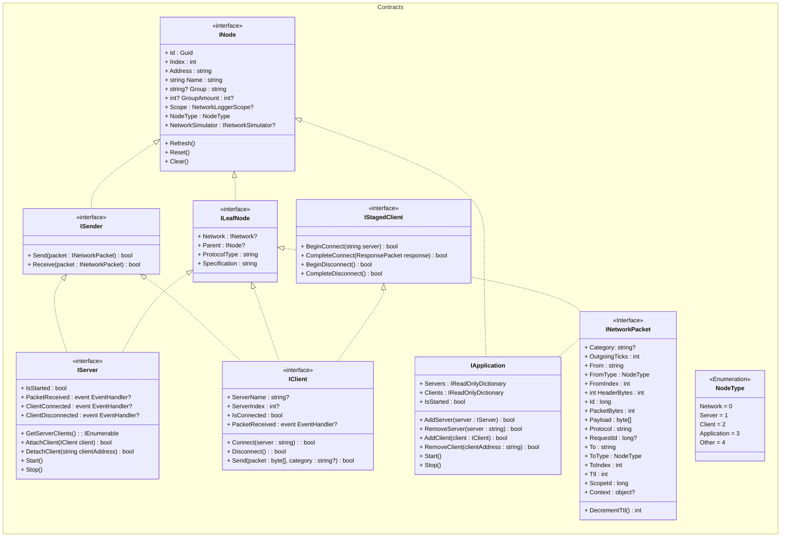

```mermaid
classDiagram
    direction RL
    namespace Contracts { 

        class INode {
            <<interface>>
            + Id : Guid
            + Index : int
            + Address : string
            + string Name  : string
            + string? Group : string
            + int? GroupAmount : int?
            + Scope : NetworkLoggerScope?
            + NodeType : NodeType
            + NetworkSimulator : INetworkSimulator?
            + Refresh()
            + Reset()
            + Clear()
        }

        class ILeafNode {
            <<interface>>
            + Network : INetwork?
            + Parent : INode?
            + ProtocolType : string
            + Specification : string
        }

        class  ISender {
            <<interface>>
            + Send(packet : INetworkPacket) bool
            + Receive(packet : INetworkPacket) bool
        }

        class IServer {
            <<interface>>
            + IsStarted : bool
            + PacketReceived : event EventHandler<INetworkPacket>?
            + ClientConnected : event EventHandler<IClient>?
            + ClientDisconnected : event EventHandler<string>? 

            + GetServerClients() : IEnumerable<IClient>
            + AttachClient(IClient client) bool 
            + DetachClient(string clientAddress) bool
            + Start()
            + Stop()
        }

        class IStagedClient {
            <<interface>>
            + BeginConnect(string server) bool
            + CompleteConnect(ResponsePacket response) bool
            + BeginDisconnect() bool 
            + CompleteDisconnect() bool
        }

        class IClient {
            <<interface>>
            + ServerName : string? 
            + ServerIndex : int?
            + IsConnected : bool
            + Connect(server : string) : bool
            + Disconnect() : bool
            + PacketReceived : event EventHandler<INetworkPacket>?
            + Send(packet : byte[], category : string?) bool

        }

        class IApplication {
            + Servers : IReadOnlyDictionary<string, IServer>
            + Clients : IReadOnlyDictionary<string, IClient>

            + IsStarted : bool

            + AddServer(server : IServer) bool
            + RemoveServer(server : string) bool
            + AddClient(client : IClient) bool
            + RemoveClient(clientAddress : string) bool
            + Start()
            + Stop()
        }

        class INetworkPacket {
            <<Interface>>
            + Category: string?
            + OutgoingTicks : int
            + From : string
            + FromType : NodeType
            + FromIndex : int
            + int HeaderBytes  : int
            + Id : long
            + PacketBytes : int
            + Payload : byte[]
            + Protocol : string
            + RequestId : long?
            + To : string
            + ToType : NodeType
            + ToIndex : int 
            + Ttl : int
            + ScopeId : long
            + Context : object?
            + DecrementTtl() int
        }

        class NodeType {
            <<Enumeration>>
            Network = 0
            Server = 1
            Client = 2
            Application = 3
            Other = 4
        }
    }


INode <|.. ILeafNode
INode <|.. ISender

ISender <|.. IServer
ILeafNode <|.. IServer

ISender <|.. IClient
ILeafNode <|.. IClient
IStagedClient <|.. IClient

INode <|.. IApplication
ILeafNode <|.. IApplication

```