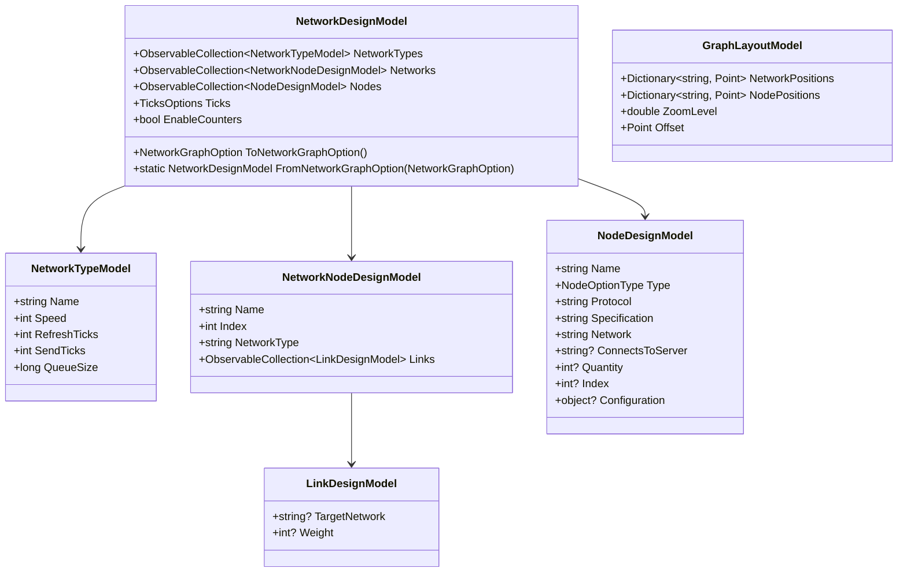
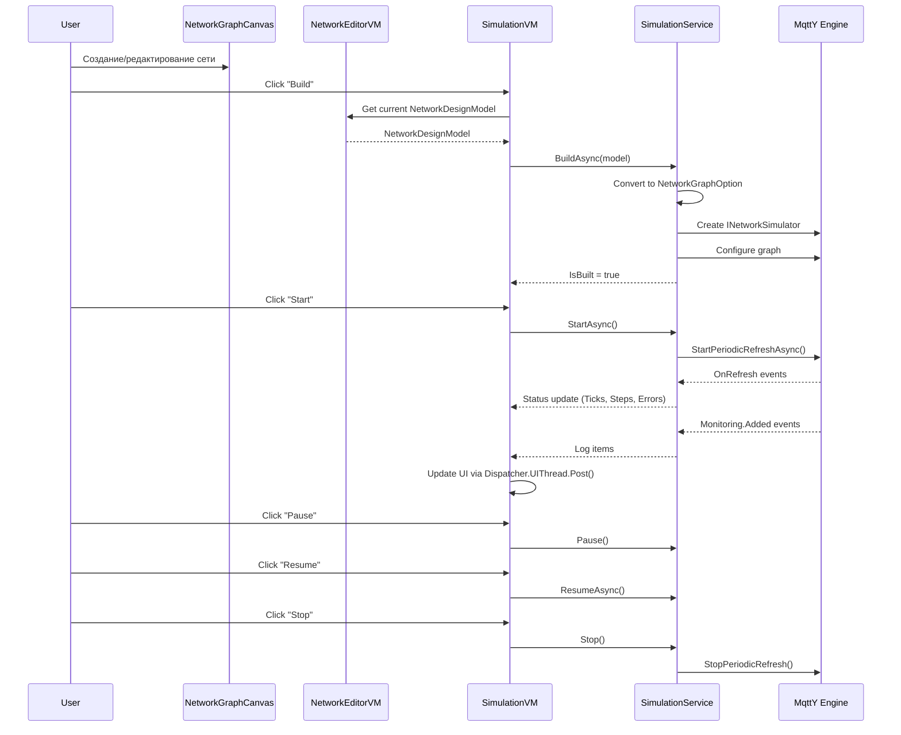

# MqttY Designer — Функциональные возможности приложения

## 1. Обзор

**MqttY Designer** — десктопное приложение на Avalonia UI для визуального конструирования симулируемых сетей на движке MqttY. Приложение позволяет создавать, редактировать, сохранять и загружать конфигурации сетей, запускать симуляцию и просматривать мониторинг в реальном времени.

**Целевая платформа:** .NET 8, Avalonia UI 11.1.3  
**Архитектура:** MVVM с использованием ReactiveUI  
**DI-контейнер:** Microsoft.Extensions.DependencyInjection

---

## 2. Основные функции

### 2.1 Визуальный редактор графа сети

**Компонент:** [`NetworkGraphCanvas`](EntityFX.MqttSimulator/EntityFX.MqttY.Designer/Views/NetworkGraphCanvas.cs) — кастомный Avalonia Control, наследующий от `Control`.

#### Отображаемые элементы

| Тип | Визуал | Цвет | Размер |
|-----|--------|------|--------|
| **Network (сеть)** | Прямоугольник с закруглёнными углами | Голубой (`#4A90D9`) | 140×70 |
| **Server (сервер)** | Прямоугольник | Синий (`#2196F3`) | 120×60 |
| **Client (клиент)** | Эллипс | Зелёный (`#4CAF50`) | 120×60 |
| **Application (приложение)** | Прямоугольник | Оранжевый (`#FF9800`) | 120×60 |
| **Link (связь)** | Линия со стрелкой | Серый с подписью веса | — |
| **Connection (подключение)** | Пунктирная линия от узла к сети | Серый | — |

#### Взаимодействие

| Действие | Описание |
|----------|----------|
| **Клик** | Выбор элемента на графе. Свойства отображаются в правой панели Inspector |
| **Drag-and-drop** | Перемещение элементов по canvas. Позиции сохраняются при перестроении графа |
| **Колёсико мыши** | Зум (масштабирование) canvas |
| **Контекстное меню (правый клик)** | Add Network Here, Add Client Here, Add Server Here, Add Application Here, Delete |
| **Двойной клик** | Открытие диалогового редактора свойств элемента |

#### Контекстное меню

При правом клике на пустой области canvas отображаются пункты:
- **Add Network Here** — создаёт сеть в позиции курсора
- **Add Client Here** — создаёт клиент в позиции курсора
- **Add Server Here** — создаёт сервер в позиции курсора
- **Add Application Here** — создаёт приложение в позиции курсора

При правом клике на существующем элементе дополнительно:
- **Delete** — удаляет элемент (узел или сеть) с очисткой ссылок

---

### 2.2 Панель инструментов (Toolbar)

Расположена над canvas. Содержит кнопки:

| Кнопка | Команда | Описание |
|--------|---------|----------|
| **Add Network Type** | `AddNetworkTypeCommand` | Добавляет новый тип сети в таблицу Network Types |
| **Add Network** | `AddNetworkCommand` | Добавляет новую сеть |
| **Add Client** | `AddNodeCommand` | Добавляет новый клиентский узел |
| **Add Server** | `AddServerCommand` | Добавляет новый сервер |
| **Add Application** | `AddApplicationCommand` | Добавляет новое приложение |
| **Delete** | `DeleteSelectedCommand` | Удаляет выбранный элемент (граф → узел → сеть) |
| **Generate Random** | `GenerateRandomNetworkCommand` | Генерирует случайную топологию для демонстрации |
| **Arrange ▼** | Выпадающее меню | Автоматическая расстановка элементов (4 алгоритма) |
| **− / Zoom / +** | `ZoomOutCommand` / `ZoomInCommand` | Уменьшение/увеличение масштаба с шагом 0.1 |

---

### 2.3 Алгоритмы автоматической расстановки

**Сервис:** [`GraphLayoutService`](EntityFX.MqttSimulator/EntityFX.MqttY.Designer/Services/GraphLayoutService.cs)

#### Circular (круговой)
- Сети располагаются по большому кругу (радиус = max(200, networks.Count × 90))
- Узлы каждой сети — по малому кругу (радиус = 110) вокруг своей сети
- Углы равномерно распределены (2π / count)

#### Force-Directed (гравитационный)
- Находит самый связанный элемент (центр) по количеству связей
- Размещает центральный элемент в центре (400, 300)
- 100 итераций симуляции физических сил:
  - **Кулоновское отталкивание** между всеми парами элементов (F ∝ 1/r²)
  - **Пружинное притяжение** по связям (F ∝ r)
  - **Гравитация** к центру для предотвращения разлёта
- **Учёт размеров:** большие узлы отталкивают сильнее (sizeFactor = площадь элемента / площадь базового узла)
- Демпфирование 0.85 для сходимости

#### Grid (сетка)
- Размер ячейки = max(ширина, высота) + отступы (60px между колонками, 40px между строками)
- Сети располагаются первыми в сетке
- Узлы группируются под своей сетью
- Количество колонок = sqrt(total × 1.5) для квадратного расположения

#### Hierarchical (иерархический)
- **Уровень 0:** все сети по горизонтали наверху
- **Уровень 1+:** узлы каждой сети вертикально под своей сетью
- Если узлов много — разбиваются на несколько колонок (nodesPerColumn ≈ 3-4)
- Непривязанные узлы — в отдельной колонке справа
- Вертикальный отступ между уровнями = NetworkSize.Height + NodeSize.Height + 120px

---

### 2.4 Правая панель (Inspector + Network Types)

#### Вкладка Inspector

Отображает свойства выбранного элемента на графе:

**Graph Item Info** (всегда при выборе):
- Name, Type, Position, Size

**Node Properties** (при выборе узла):
- Name (TextBox), Type (ComboBox: Client/Server/Application), Protocol, Specification
- Network (ComboBox со списком сетей), ConnectsToServer, Quantity

**Network Properties** (при выборе сети):
- Name, Index, NetworkType (ComboBox со списком типов)

**Network Type Properties** (при выборе типа сети в таблице):
- Name, Speed, RefreshTicks, SendTicks, QueueSize

#### Вкладка Network Types

Таблица (DataGrid) со списком типов сетей:
- Колонки: Name, Speed, Refresh Ticks, Send Ticks, Queue Size
- Кнопки: Add (добавить тип), Delete (удалить выбранный тип)

---

### 2.5 Генератор случайной сети

**Команда:** `GenerateRandomNetworkCommand`  
**Метод:** [`GenerateRandomNetwork()`](EntityFX.MqttSimulator/EntityFX.MqttY.Designer/ViewModels/NetworkEditorViewModel.cs:555)

Генерирует демонстрационную топологию:
1. **1-3 случайных NetworkType** из набора {10g, 1g, wifi5} с соответствующими скоростями
2. **2-5 сетей** со случайными связями (30% вероятность связи между каждой парой)
3. **3-10 узлов** с распределением:
   - 50% Client (mqtt-client, mqtt-publisher, mqtt-subscriber)
   - 30% Server (mqtt-broker, mqtt-relay)
   - 20% Application (mqtt-relay, mqtt-forwarder)
4. Узлы случайно распределяются по сетям

---

### 2.6 Сохранение и загрузка проектов

**Сервис:** [`ConfigurationService`](EntityFX.MqttSimulator/EntityFX.MqttY.Designer/Services/ConfigurationService.cs)

#### Формат: JSON (NetworkGraphOption)

| Действие | Команда | Описание |
|----------|---------|----------|
| **New** | `NewCommand` | Создаёт новый пустой проект |
| **Open** | `OpenCommand` | Загружает JSON-файл через диалог |
| **Save** | `SaveCommand` | Сохраняет в текущий файл (или вызывает Save As) |
| **Save As** | `SaveAsCommand` | Сохраняет в новый файл через диалог |
| **Import GraphML** | `ImportGraphMLCommand` | Импортирует топологию из GraphML-файла |

#### Импорт GraphML

**Сервис:** [`GraphMLImporterService`](EntityFX.MqttSimulator/EntityFX.MqttY.Designer/Services/GraphMLImporterService.cs)

Парсит GraphML-файлы (namespace `http://graphml.graphdrawing.org/xmlns`):
- Извлекает определения ключей (key → attr.name, type, for)
- Классифицирует узлы по типу (network/client/server/application) через data-атрибут `type` или префикс id
- Извлекает data-атрибуты: label, address, type, networkType, protocol, specification, connectsTo, weight
- Создаёт NetworkType из уникальных типов сетей
- Добавляет сети, клиенты, серверы, приложения
- Резолвит принадлежность узла к сети через edges
- Добавляет связи между сетями из edges (с предотвращением дубликатов)

---

### 2.7 Симуляция

**Сервис:** [`SimulationService`](EntityFX.MqttSimulator/EntityFX.MqttY.Designer/Services/SimulationService.cs)  
**ViewModel:** [`SimulationViewModel`](EntityFX.MqttSimulator/EntityFX.MqttY.Designer/ViewModels/SimulationViewModel.cs)  
**View:** [`SimulationView`](EntityFX.MqttSimulator/EntityFX.MqttY.Designer/Views/SimulationView.axaml)

#### Управление симуляцией

| Кнопка | Команда | Описание |
|--------|---------|----------|
| **Build** | `BuildCommand` | Собирает симуляцию из текущей конфигурации |
| **Start** | `StartCommand` | Запускает симуляцию (StartPeriodicRefreshAsync) |
| **Pause / Resume** | `PauseCommand` / `ResumeCommand` | Приостанавливает / возобновляет симуляцию |
| **Stop** | `StopCommand` | Останавливает симуляцию |

#### Статус-бар

Отображает метрики в реальном времени:
- **Status:** Running / Paused / Stopped / Building
- **Ticks:** общее количество тиков симуляции
- **Steps:** общее количество шагов
- **Errors:** количество ошибок
- **Nodes:** количество узлов в симуляции

#### Вкладка States

Таблицы состояния сетей и узлов во время симуляции:
- **Networks:** Name, Address, Queue Length, Connected Nodes
- **Nodes:** Name, Address, Type, Network, Connected, Queue Length

#### Вкладка Logs

Таблица логов симуляции в реальном времени:
- Колонки: Tick, Time, From, To, Type, Protocol, Message, Size, Queue
- Автоматическое добавление записей через `Dispatcher.UIThread.Post()`
- Ограничение: максимум 1000 записей (старые удаляются)

---

### 2.8 Зум и навигация

- **Кнопки +/−** на тулбаре: шаг 0.1, диапазон 0.1..5.0
- **Колёсико мыши** на canvas: плавный зум
- Отображение текущего уровня зума в процентах (формат `{0:P0}`)

---

### 2.9 Удаление элементов

| Способ | Описание |
|--------|----------|
| **Кнопка Delete** на тулбаре | Удаляет выбранный элемент (сначала GraphItem, потом Node, потом Network) |
| **Контекстное меню → Delete** | Удаляет элемент под курсором |
| **Кнопка Delete** в таблице Network Types | Удаляет выбранный тип сети |

При удалении сети автоматически удаляются все ссылки на неё из других сетей.

---

## 3. Модель данных

### 3.1 UI-модели (обёртки над Options)



### 3.2 Canvas-модели

```csharp
public enum GraphItemType { Network, Client, Server, Application }

public class GraphItem {
    string Name;
    string SubLabel;
    GraphItemType ItemType;
    Point Position;
    Size Size;
    object? Tag;  // ссылка на NodeDesignModel или NetworkNodeDesignModel
}

public class GraphLink {
    GraphItem From;
    GraphItem To;
    string Label;
    object? Tag;  // ссылка на LinkDesignModel
}
```

---

## 4. Сервисный слой

| Сервис | Интерфейс | Назначение |
|--------|-----------|------------|
| [`ConfigurationService`](EntityFX.MqttSimulator/EntityFX.MqttY.Designer/Services/ConfigurationService.cs) | `IConfigurationService` | Загрузка/сохранение JSON |
| [`GraphLayoutService`](EntityFX.MqttSimulator/EntityFX.MqttY.Designer/Services/GraphLayoutService.cs) | `IGraphLayoutService` | 4 алгоритма расстановки |
| [`SimulationService`](EntityFX.MqttSimulator/EntityFX.MqttY.Designer/Services/SimulationService.cs) | — | Управление симуляцией MqttY |
| [`GraphMLImporterService`](EntityFX.MqttSimulator/EntityFX.MqttY.Designer/Services/GraphMLImporterService.cs) | — | Импорт GraphML |
| [`DialogService`](EntityFX.MqttSimulator/EntityFX.MqttY.Designer/Services/DialogService.cs) | `IDialogService` | Отображение диалоговых окон |

---

## 5. DI-регистрации

```csharp
// В App.axaml.cs
services
    .AddSingleton<MainWindowViewModel>()
    .AddSingleton<NetworkEditorViewModel>()
    .AddSingleton<SimulationViewModel>()
    .AddSingleton<IConfigurationService, ConfigurationService>()
    .AddSingleton<IGraphLayoutService, GraphLayoutService>()
    .AddSingleton<IDialogService, DialogService>()
    .AddSingleton<GraphMLImporterService>()
    .AddSingleton<SimulationService>()
    // Регистрации из MqttY Core
    .ConfigureServices()
    .ConfigureMqttServices()
    .ConfigureNodesBuilder();
```

---

## 6. Структура проекта

```
EntityFX.MqttY.Designer/
├── App.axaml / App.axaml.cs          # Настройка DI и стилей
├── Program.cs                         # Точка входа
├── Models/
│   ├── NetworkDesignModel.cs          # Модель дизайна сети
│   ├── NetworkTypeModel.cs            # Тип сети
│   ├── NetworkNodeDesignModel.cs      # Сеть с Links
│   ├── NodeDesignModel.cs             # Узел (Client/Server/Application)
│   ├── LinkDesignModel.cs             # Связь между сетями
│   └── GraphLayoutModel.cs            # Позиции на canvas
├── ViewModels/
│   ├── MainWindowViewModel.cs         # Главная VM (меню, вкладки)
│   ├── NetworkEditorViewModel.cs      # Редактор сети (граф + инспектор)
│   ├── SimulationViewModel.cs         # Управление симуляцией + логи
│   ├── NodeEditorViewModel.cs         # Диалог редактирования узла
│   ├── NetworkTypeEditorViewModel.cs  # Диалог редактирования типа сети
│   └── EditNetworkViewModel.cs        # Диалог редактирования сети
├── Views/
│   ├── MainWindow.axaml / .cs         # Главное окно
│   ├── NetworkEditorView.axaml / .cs  # Редактор сети
│   ├── NetworkGraphCanvas.cs          # Кастомный canvas
│   ├── SimulationView.axaml / .cs     # Панель симуляции
│   ├── NodeEditorWindow.axaml / .cs   # Диалог узла
│   ├── NetworkTypeEditorWindow.axaml / .cs  # Диалог типа сети
│   └── EditNetworkWindow.axaml / .cs  # Диалог сети
├── Services/
│   ├── IConfigurationService.cs       # Интерфейс JSON
│   ├── ConfigurationService.cs        # Реализация JSON
│   ├── IGraphLayoutService.cs         # Интерфейс расстановки
│   ├── GraphLayoutService.cs          # 4 алгоритма расстановки
│   ├── GraphMLImporterService.cs      # Импорт GraphML
│   ├── SimulationService.cs           # Управление симуляцией
│   ├── IDialogService.cs              # Интерфейс диалогов
│   └── DialogService.cs               # Реализация диалогов
└── Converters/
    └── StringNotEmptyConverter.cs     # Конвертер для IsVisible
```

---

## 7. Поток данных при запуске симуляции



---

## 8. Клавиатурные сокращения

| Сочетание | Действие |
|-----------|----------|
| `Ctrl+N` | New project |
| `Ctrl+O` | Open project |
| `Ctrl+S` | Save project |
| `Ctrl+Shift+S` | Save As |
| `Delete` | Delete selected element |

---

## 9. Ограничения и заметки

- **Максимум логов:** 1000 записей (кольцевой буфер)
- **Диапазон зума:** 0.1x — 5.0x
- **Force-Directed:** 100 итераций, фиксированный seed (42) для воспроизводимости
- **Сборка:** .NET 8 для Designer, .NET 6 для MqttY Core
- **Предупреждения:** 4 известных (CS1998, CS0618) — не влияют на функциональность