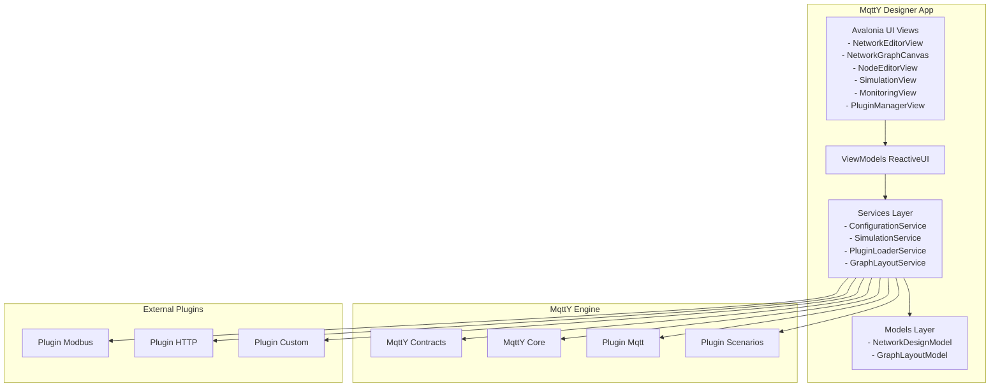
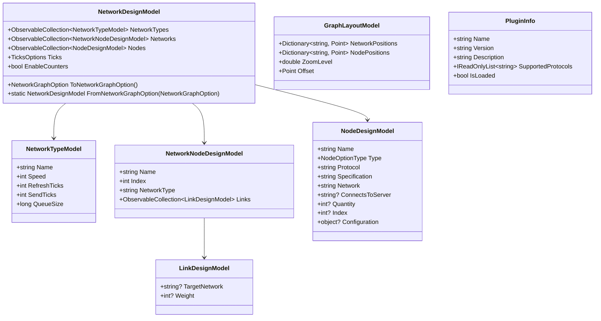
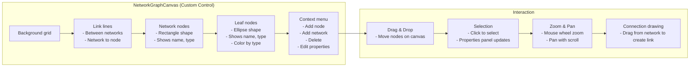
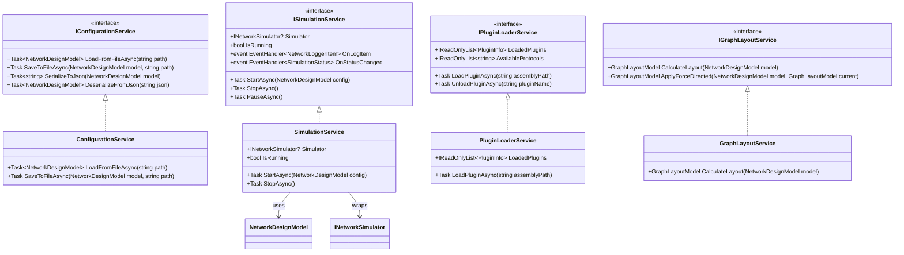
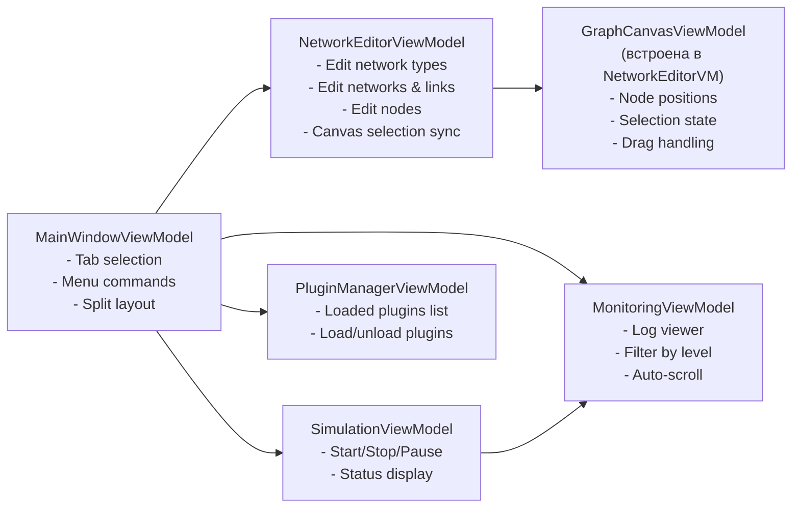
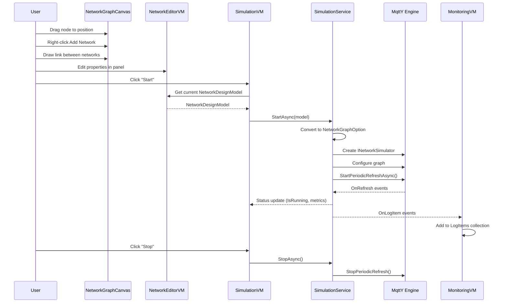

# План разработки MqttY Designer — Avalonia UI приложение

## 1. Обзор

**MqttY Designer** — десктопное приложение на Avalonia UI для визуального конструирования симулируемых сетей на движке MqttY. Приложение позволяет создавать, редактировать, сохранять и загружать конфигурации сетей, запускать симуляцию и просматривать мониторинг в реальном времени.

**Целевая платформа:** .NET 8, Avalonia UI 11.x  
**Архитектура:** MVVM с использованием ReactiveUI  
**Базовый функционал (MVP):**
- Визуальный редактор графа сети (canvas с узлами и связями)
- Табличный редактор свойств узлов и сетей
- Загрузка/сохранение JSON-конфигураций (формат NetworkGraphOption)
- Запуск/остановка симуляции
- Мониторинг логов симуляции в реальном времени
- Архитектура для подключения плагинов

---

## 2. Структура решения

Новый проект будет добавлен в существующее решение `EntityFX.MqttSimulator/EntityFX.Mqtty.sln`.

```
EntityFX.MqttSimulator/
├── EntityFX.MqttY.Designer/                    # НОВЫЙ ПРОЕКТ - Avalonia UI приложение
│   ├── EntityFX.MqttY.Designer.csproj
│   ├── App.axaml
│   ├── App.axaml.cs
│   ├── Program.cs
│   ├── ViewModels/
│   │   ├── MainWindowViewModel.cs              # Главная VM
│   │   ├── NetworkEditorViewModel.cs           # Редактор сети (таблицы + граф)
│   │   ├── NodeEditorViewModel.cs              # Редактор узла (диалог)
│   │   ├── SimulationViewModel.cs              # Управление симуляцией
│   │   ├── MonitoringViewModel.cs              # Мониторинг логов
│   │   └── PluginManagerViewModel.cs           # Управление плагинами
│   ├── Views/
│   │   ├── MainWindow.axaml
│   │   ├── MainWindow.axaml.cs
│   │   ├── NetworkEditorView.axaml
│   │   ├── NetworkEditorView.axaml.cs
│   │   ├── NetworkGraphCanvas.axaml            # КАСТОМНЫЙ КОНТРОЛ - визуальный граф
│   │   ├── NetworkGraphCanvas.axaml.cs
│   │   ├── NodeEditorView.axaml
│   │   ├── NodeEditorView.axaml.cs
│   │   ├── SimulationView.axaml
│   │   ├── SimulationView.axaml.cs
│   │   ├── MonitoringView.axaml
│   │   ├── MonitoringView.axaml.cs
│   │   ├── PluginManagerView.axaml
│   │   └── PluginManagerView.axaml.cs
│   ├── Models/
│   │   ├── NetworkDesignModel.cs               # Модель дизайна сети (UI-модель)
│   │   ├── NetworkTypeModel.cs                 # Тип сети (10g, 1g, wifi5...)
│   │   ├── NodeDesignModel.cs                  # Модель узла в дизайнере
│   │   ├── LinkDesignModel.cs                  # Модель связи между сетями
│   │   ├── GraphLayoutModel.cs                 # Позиции узлов на canvas
│   │   └── PluginInfo.cs                       # Информация о плагине
│   ├── Services/
│   │   ├── IConfigurationService.cs            # Интерфейс загрузки/сохранения JSON
│   │   ├── ConfigurationService.cs             # Реализация загрузки/сохранения
│   │   ├── ISimulationService.cs               # Интерфейс управления симуляцией
│   │   ├── SimulationService.cs                # Реализация симуляции
│   │   ├── IPluginLoaderService.cs             # Интерфейс загрузки плагинов
│   │   ├── PluginLoaderService.cs              # Реализация загрузки плагинов
│   │   ├── IGraphLayoutService.cs              # Интерфейс авто-раскладки графа
│   │   └── GraphLayoutService.cs               # Реализация авто-раскладки
│   ├── Converters/
│   │   ├── NodeTypeToStringConverter.cs        # Конвертер NodeOptionType -> string
│   │   ├── BoolToColorConverter.cs             # Конвертер для статуса
│   │   └── NodeTypeToColorConverter.cs         # Цвет узла по типу
│   └── Infrastructure/
│       ├── ServiceCollectionExtensions.cs      # DI регистрации
│       └── DesignTimeData.cs                   # Данные для Design-Time Preview
├── EntityFX.MqttY.Designer.Plugins/           # НОВЫЙ ПРОЕКТ - контракты плагинов
│   └── IDesignerPlugin.cs                     # Интерфейс плагина для дизайнера
```

---

## 3. Архитектура и компоненты

### 3.1 Общая архитектура



### 3.2 Модель данных (UI Models)

Модели для UI являются обёртками над опциями из `EntityFX.MqttY.Contracts.Options`:



### 3.3 Визуальный компонент графа (NetworkGraphCanvas)



**Реализация:** Кастомный Avalonia Control, наследующий от `Panel`. Отрисовка через `DrawingContext` в методе `Render()`. Альтернатива — использование `Avalonia.Controls.ItemsRepeater` с виртуализацией, но для MVP проще кастомная отрисовка.

**Основные элементы отрисовки:**
- **Сети (Networks):** прямоугольники с закруглёнными углами, цвет фона по типу сети
- **Узлы (Nodes):** эллипсы/прямоугольники, цвет по типу узла (Client=зелёный, Server=синий, Application=оранжевый)
- **Связи (Links):** линии со стрелками между сетями
- **Привязки (Connections):** линии от узла к его сети

### 3.4 Сервисный слой



### 3.5 ViewModels и маршрутизация



---

## 4. Поэтапный план реализации

### Этап 1: Создание проекта и базовой инфраструктуры

**Задачи:**
1. Создать проект `EntityFX.MqttY.Designer` (Avalonia UI, .NET 8)
2. Настроить `.csproj` с зависимостями:
   - Avalonia.Desktop 11.x
   - Avalonia.ReactiveUI 11.x
   - ProjectReference на `EntityFX.MqttY.csproj`
   - ProjectReference на `EntityFX.MqttY.Plugin.Mqtt.csproj`
   - ProjectReference на `EntityFX.MqttY.Plugin.Scenarios.csproj`
3. Создать `Program.cs` с настройкой Avalonia AppBuilder
4. Создать `App.axaml` / `App.axaml.cs` с DI-контейнером (Microsoft.Extensions.DependencyInjection)
5. Создать `MainWindow.axaml` с TabControl (вкладки: Редактор сети, Симуляция, Мониторинг, Плагины)
6. Создать `MainWindowViewModel.cs` с управлением вкладками и командами меню (New, Open, Save, Save As)

**Ключевые файлы:** `Program.cs`, `App.axaml`, `App.axaml.cs`, `MainWindow.axaml`, `MainWindow.axaml.cs`, `MainWindowViewModel.cs`

### Этап 2: Модели данных и ConfigurationService

**Задачи:**
1. Создать UI-модели:
   - `NetworkDesignModel` — обёртка над `NetworkGraphOption`
   - `NetworkTypeModel` — обёртка над `NetworkOptions`
   - `NetworkNodeDesignModel` — обёртка над `NetworkNodeOption`
   - `LinkDesignModel` — обёртка над `NetworkLinkOption`
   - `NodeDesignModel` — обёртка над `NodeOption`
   - `GraphLayoutModel` — позиции элементов на canvas
2. Реализовать методы конвертации `ToNetworkGraphOption()` / `FromNetworkGraphOption()`
3. Создать `IConfigurationService` / `ConfigurationService`:
   - `LoadFromFileAsync(string path)` — десериализация JSON в `NetworkDesignModel`
   - `SaveToFileAsync(NetworkDesignModel model, string path)` — сериализация в JSON
   - Использовать `System.Text.Json` с кастомными конвертерами для `SortedDictionary`
4. Добавить команды Open/Save в `MainWindowViewModel`

**Ключевые файлы:** Все файлы в `Models/`, `Services/IConfigurationService.cs`, `Services/ConfigurationService.cs`

### Этап 3: Визуальный редактор графа (NetworkGraphCanvas)

**Задачи:**
1. Создать кастомный контрол `NetworkGraphCanvas` (наследник `Panel`):
   - Хранение коллекции `GraphItem` (сеть или узел с позицией, размером, цветом)
   - Хранение коллекции `GraphLink` (линия между двумя `GraphItem`)
   - Отрисовка в `Render()`: линии связей, затем прямоугольники/эллипсы элементов
   - Обработка mouse events: клик (выбор), drag (перемещение), колесо (zoom)
   - Контекстное меню: Add Network, Add Node, Delete, Edit Properties
   - Режим соединения: drag от одной сети к другой для создания Link
2. Создать `GraphLayoutService`:
   - Force-directed алгоритм для автоматической расстановки узлов
   - Сохранение позиций в `GraphLayoutModel`
3. Интегрировать `NetworkGraphCanvas` в `NetworkEditorView`:
   - Левая панель: canvas с графом
   - Правая панель: Properties panel (свойства выбранного элемента)
4. Создать `NetworkEditorViewModel`:
   - Синхронизация `NetworkDesignModel` с отображаемыми элементами на canvas
   - Команды: AddNetwork, AddNode, Delete, EditProperties
   - Reactive-свойство `SelectedItem` для привязки Properties panel

**Визуальное представление элементов:**
- **Network (сеть):** прямоугольник с закруглёнными углами, голубой фон, название и тип сети
- **Server (сервер):** прямоугольник, синий фон, название
- **Client (клиент):** эллипс, зелёный фон, название
- **Application (приложение):** шестиугольник (или прямоугольник со скруглением), оранжевый фон, название
- **Link (связь):** линия со стрелкой, подпись веса (w)
- **Connection (подключение):** пунктирная линия от узла к сети

**Ключевые файлы:** `NetworkGraphCanvas.axaml`, `NetworkGraphCanvas.axaml.cs`, `NetworkEditorView.axaml`, `NetworkEditorView.axaml.cs`, `NetworkEditorViewModel.cs`, `GraphLayoutService.cs`, `GraphLayoutModel.cs`

### Этап 4: Диалоговые редакторы свойств

**Задачи:**
1. Создать `NodeEditorView` / `NodeEditorViewModel`:
   - Поля: Name, Type (ComboBox: Client/Server/Application), Protocol, Specification, Network (выбор из списка), ConnectsToServer, Quantity, Index
   - Валидация: Name обязателен, Network должна существовать
2. Создать `NetworkTypeEditorView` / `NetworkTypeEditorViewModel`:
   - Поля: Name, Speed, RefreshTicks, SendTicks, QueueSize
3. Создать `NetworkEditorView` (диалог) / `NetworkEditorViewModel`:
   - Поля: Name, Index, NetworkType (выбор из списка типов)
   - Редактор Links: таблица TargetNetwork + Weight
4. Все диалоги открываются через `WindowService` или `Interaction<Window>` из ReactiveUI

**Ключевые файлы:** `NodeEditorView.axaml`, `NodeEditorViewModel.cs`, `NetworkTypeEditorView.axaml`, `NetworkTypeEditorViewModel.cs`, диалоговые окна

### Этап 5: Интеграция симуляции

**Задачи:**
1. Создать `ISimulationService` / `SimulationService`:
   - Использовать `NetworkGraphFactory`, `NetworkSimulatorBuilder`, `NodesBuilder` из MqttY Core
   - Метод `StartAsync(NetworkDesignModel config)`:
     - Конвертировать `NetworkDesignModel` в `NetworkGraphOption`
     - Создать `INetworkSimulator` через `NetworkGraphFactory`
     - Настроить через `NetworkSimulatorBuilder.Configure()`
     - Запустить `StartPeriodicRefreshAsync()`
   - Метод `StopAsync()` — остановить симуляцию
   - Подписаться на `OnRefresh` и `Monitoring` для получения логов
2. Создать `SimulationViewModel.cs`:
   - Свойства: `IsRunning`, `VirtualTime`, `RealTime`, `TotalTicks`, `TotalSteps`, `Errors`
   - Команды: `StartCommand`, `StopCommand`
   - При старте передавать текущую конфигурацию из `NetworkEditorViewModel`
3. Создать `SimulationView.axaml`:
   - Кнопки Start/Stop
   - Статус-бар с метриками (VirtualTime, RealTime, Ticks, Steps, Errors)

**Ключевые файлы:** `Services/ISimulationService.cs`, `Services/SimulationService.cs`, `SimulationViewModel.cs`, `SimulationView.axaml`

### Этап 6: Мониторинг логов

**Задачи:**
1. Создать `MonitoringViewModel.cs`:
   - `ObservableCollection<NetworkLoggerItem> LogItems`
   - Свойства фильтрации: `FilterByType`, `AutoScroll`
   - Подписка на `ISimulationService.OnLogItem`
   - Команда `ClearLogCommand`
2. Создать `MonitoringView.axaml`:
   - ListBox/DataGrid с логами (время, тип, источник, сообщение)
   - Цветовая индикация по типу лога (Info, Warning, Error)
   - CheckBox "Auto-scroll"
   - Кнопка "Clear"
   - Фильтр по типу (ComboBox)

**Ключевые файлы:** `MonitoringViewModel.cs`, `MonitoringView.axaml`

### Этап 7: Архитектура плагинов

**Задачи:**
1. Создать проект `EntityFX.MqttY.Designer.Plugins` с интерфейсом:
   ```csharp
   public interface IDesignerPlugin
   {
       string Name { get; }
       string Version { get; }
       string Description { get; }
       string[] SupportedProtocols { get; }
       void Initialize(IServiceProvider serviceProvider);
       void RegisterFactories(INodesBuilder nodesBuilder);
   }
   ```
2. Создать `IPluginLoaderService` / `PluginLoaderService`:
   - Загрузка сборок из директории `plugins/`
   - Поиск типов, реализующих `IDesignerPlugin`
   - Регистрация фабрик в `NodesBuilder`
3. Создать `PluginManagerViewModel.cs`:
   - `ObservableCollection<PluginInfo> Plugins`
   - Команды: `LoadPluginCommand`, `UnloadPluginCommand`, `RefreshPluginsCommand`
4. Создать `PluginManagerView.axaml`:
   - DataGrid со списком плагинов (Name, Version, Description, Protocols, Status)
   - Кнопки Load/Unload/Refresh

**Ключевые файлы:** `IDesignerPlugin.cs`, `Services/IPluginLoaderService.cs`, `Services/PluginLoaderService.cs`, `PluginManagerViewModel.cs`, `PluginManagerView.axaml`

### Этап 8: Интеграция и тестирование

**Задачи:**
1. Связать все ViewModel через DI
2. Проверить полный цикл: создание конфигурации -> сохранение -> загрузка -> запуск симуляции -> мониторинг
3. Проверить загрузку существующего `appsettings.json` из CLI-проекта
4. Проверить работу плагинов (Mqtt как встроенный плагин)
5. Добавить обработку ошибок и валидацию

---

## 5. Зависимости NuGet

| Пакет | Версия | Назначение |
|-------|--------|------------|
| Avalonia.Desktop | 11.1.x | Фреймворк UI |
| Avalonia.ReactiveUI | 11.1.x | MVVM + Reactive Extensions |
| Avalonia.Controls.DataGrid | 11.1.x | Таблицы свойств |
| Microsoft.Extensions.DependencyInjection | 8.0.x | DI-контейнер |
| System.Text.Json | встроенный | Сериализация JSON |

---

## 6. DI-регистрации (ServiceCollection)

```csharp
// В App.axaml.cs или отдельном методе ConfigureServices
services
    .AddSingleton<MainWindowViewModel>()
    .AddSingleton<NetworkEditorViewModel>()
    .AddSingleton<SimulationViewModel>()
    .AddSingleton<MonitoringViewModel>()
    .AddSingleton<PluginManagerViewModel>()
    .AddSingleton<IConfigurationService, ConfigurationService>()
    .AddSingleton<ISimulationService, SimulationService>()
    .AddSingleton<IPluginLoaderService, PluginLoaderService>()
    .AddSingleton<IGraphLayoutService, GraphLayoutService>()
    // Регистрации из MqttY Core
    .ConfigureServices()
    .ConfigureMqttServices()
    // NodesBuilder с поддержкой плагинов
    .ConfigureNodesBuilder();
```

---

## 7. Поток данных при запуске симуляции



---

## 8. Todo-лист для реализации

```
[x] Изучить архитектуру MqttY
[x] Согласовать требования
[-] Этап 1: Создание проекта и базовой инфраструктуры
[ ] Этап 2: Модели данных и ConfigurationService
[ ] Этап 3: Визуальный редактор графа (NetworkGraphCanvas)
[ ] Этап 4: Диалоговые редакторы свойств
[ ] Этап 5: Интеграция симуляции
[ ] Этап 6: Мониторинг логов
[ ] Этап 7: Архитектура плагинов
[ ] Этап 8: Интеграция и тестирование
```

---

## 9. Критерии готовности MVP

- [x] Приложение запускается и отображает главное окно с вкладками
- [x] Визуальный canvas с графом сети (сети = прямоугольники, узлы = фигуры по типу)
- [x] Drag-and-drop перемещение элементов на canvas
- [x] Контекстное меню для добавления/удаления элементов
- [x] Возможность создать/редактировать типы сетей (NetworkTypes)
- [x] Возможность создать/редактировать сети и связи между ними (Networks/Links)
- [x] Возможность создать/редактировать узлы (Nodes: Client, Server, Application)
- [x] Загрузка существующей JSON-конфигурации (формат appsettings.json)
- [x] Сохранение конфигурации в JSON
- [x] Запуск симуляции на основе созданной конфигурации
- [x] Отображение логов симуляции в реальном времени
- [x] Остановка симуляции
- [x] Архитектура для подключения плагинов (IDesignerPlugin, PluginLoaderService)
- [x] Mqtt-плагин работает как встроенный (через существующие сборки)