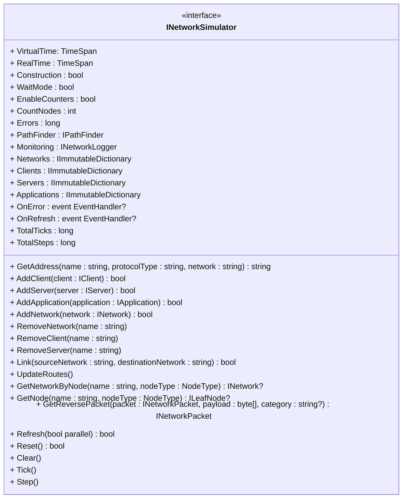

```mermaid
classDiagram

    class INetworkSimulator {
        <<interface>>
        + VirtualTime: TimeSpan
        + RealTime : TimeSpan
        + Construction : bool
        + WaitMode : bool
        + EnableCounters : bool 
        + CountNodes : int 
        + Errors : long
        + PathFinder : IPathFinder
        + Monitoring : INetworkLogger

        + Networks : IImmutableDictionary<string, INetwork>
        + Clients : IImmutableDictionary<string, IClient>
        + Servers : IImmutableDictionary<string, IServer>
        + Applications : IImmutableDictionary<string, IApplication>

        + OnError : event EventHandler<Exception>?
        + OnRefresh : event EventHandler<long>?

        + GetAddress(name : string, protocolType : string, network : string)  string

        + AddClient(client : IClient) bool
        + AddServer(server : IServer) bool
        + AddApplication(application : IApplication) bool
        + AddNetwork(network : INetwork) bool

        + RemoveNetwork(name : string)
        + RemoveClient(name : string)
        + RemoveServer(name : string)
        + Link(sourceNetwork : string, destinationNetwork : string) bool

        + UpdateRoutes()

        + GetNetworkByNode(name : string, nodeType : NodeType)  INetwork? 
        + GetNode(name : string, nodeType : NodeType) ILeafNode? 
        + GetReversePacket( packet : INetworkPacket, payload : byte[], category : string?) INetworkPacket

        + Refresh(bool parallel) bool
        + Reset() bool
        + Clear()
        + Tick()
        + Step()

        + TotalTicks : long
        + TotalSteps : long

    }


```